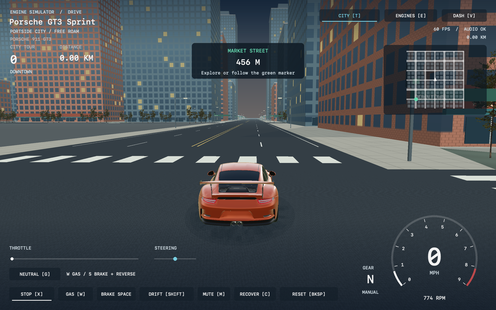

# Engine Sim for macOS

A native Apple Silicon engine-sound playground: C++ simulation and audio,
AppKit controls, and a Metal dashboard with moving pistons, cams, gauges,
live audio plots, and a playable driving game with a chase camera.

An independent community fork of [Ange Yaghi's Engine Simulator](https://github.com/ange-yaghi/engine-sim),
built on [Carles Onielfa's Open Engine Simulator](https://github.com/carlesonielfa/open-engine-sim).
The original simulation, sounds, and visual design are their work. This fork
focuses on responsive sound and a native Mac interface.



[Coast](docs/images/portside-coast.png) · [Port](docs/images/portside-harbor.png)
· [Parks](docs/images/portside-park.png) · [Stadium](docs/images/portside-stadium.png)
· [BMW](docs/images/car-bmw_e36.png) · [Audi](docs/images/car-audi_quattro.png)
· [Subaru](docs/images/car-subaru_wrx_sti.png) · [Ferrari F1](docs/images/car-ferrari_f1_2019.png)
· [Piston cutaway](docs/images/porsche-gt3.png).

## What works

- 24 selectable engine/car presets, including Porsche flat-sixes, BMW M52B28, Supra 2JZ,
  GM LS, Ferrari V8/V12, and Lexus LFA V10.
- GT3 Sprint: a faster fictional arcade tune using the GT3 engine and body,
  a lighter vehicle, lower drag and a seven-speed gearbox. Start it in the city
  with `./run-fast.sh`, or choose **Porsche GT3 Sprint** in the Engines menu.
- Hold-to-rev keyboard/mouse input, a persistent throttle slider, live exhaust
  and noise controls, mute, ignition, and a layered engine cutaway.
- Automatic Drive mode uses the real vehicle load and gearbox, handles clutch
  launch and up/downshifts, and briefly cuts throttle during a shift. Braking
  cuts the accelerator, prevents new upshifts, and downshifts for engine braking.
- Clear native Mac monospaced text, rasterized once into a Retina font atlas.
- Portside City: a 3.12 × 3.12 km free-roam map with 361 connected
  intersections and 1,399 structures across eight districts. Explore downtown
  towers, old-town shops, residential streets, university courtyards, parks,
  a stadium, fuel stations, a container port and the coastal promenade. Wide
  express avenues connect the districts; a local minimap and 12 named tour
  stops guide exploration.
  **T** switches between the city and forest circuit after stopping the car.
- A closed forest circuit with arcade steering, off-road resistance and
  barrier collisions. A three-lap time trial has ordered checkpoints, lap/best
  timers, a finish state and a minimap. Recover to the last checkpoint or start
  a new run without reloading the engine.
- Fourteen real vehicle body models covering all 24 engine selections,
  with reflective paint, textured trim, working brake lights, rolling and steering wheels, body lean,
  a responsive chase camera and a large MPH/RPM/gear HUD. The engine simulation drives
  actual forward and reverse travel; road and wheel motion use metres.
  The sun stays in the world, moving across the view as the car turns.
- Arcade handling with strong cornering, fast self-centring and forgiving wall
  scrapes. Short keyboard taps still make small corrections at speed, and grass
  retains most steering control. Strong brakes work with **S**, **Down** or
  **Space** in driving view; **X** operates the ignition there.
- Hold **S/Down** after stopping to reverse; **W/Up** brakes out of reverse
  before moving forward. Hold **Shift** while steering for an assisted drift,
  with skid marks and drift points. Releasing it smoothly restores grip.
- Audio production runs independently of the UI. The renderer consumes bounded
  snapshots; a slow or hidden window does not have to delay sound production.
- Native Metal rendering, display-synchronized by default, with optional glow
  and an uncapped mode. A local M1/60 Hz run sustained about 60 completed frames
  per second with no missing audio frames. This is a measurement, not a guarantee
  for every engine or machine.
- A separate terminal/audio-only host and programmatic audio/GUI tests.

The new Porsche presets are **approximate sound models**, not recordings or
factory-calibrated simulations. See [engines and provenance](docs/ENGINES.md).
Press **E** to choose a car: Porsche GT3/930, Supra, Ferrari 458/F1, Corvette,
BMW E36, Audi Quattro, Honda Integra, Subaru WRX STI, Lexus LFA, Nissan 350Z,
Caterham Seven and a Ford hot-rod pickup. Engine variants share bodies;
non-matching, motorcycle and aircraft engines are explicitly labelled as game
engine swaps. See [all body assignments and credits](docs/ENGINES.md#car-bodies).
This is an experimental sound simulator, not an engineering or tuning tool.

## Build on an Apple Silicon Mac

Requires macOS 14+, full Xcode with its Metal compiler, Homebrew, and CMake 3.25+.
The current native app has been tested on an M1 running macOS 26; older supported
macOS versions still need real-machine testing. Command Line Tools alone may
not provide the Metal compiler.

```sh
brew install cmake ninja bison flex
export PATH="$(brew --prefix bison)/bin:$(brew --prefix flex)/bin:$PATH"

# Check that full Xcode and the Metal compiler are selected.
xcodebuild -version
xcrun -sdk macosx metal --version

git clone --recurse-submodules https://github.com/beejmaxx/engine-sim-macos.git
cd engine-sim-macos
cmake --preset macos-arm64-package
cmake --build --preset macos-arm64-package --parallel 4
cmake --install build/macos-arm64-package --prefix "$PWD/dist"
./run-sound-gui.sh --preset porsche_911_gt3 --play --drive --city
```

If Xcode 26 reports a missing Metal Toolchain, install that component with
`xcodebuild -downloadComponent MetalToolchain`.
[Apple's component instructions](https://developer.apple.com/documentation/Xcode/downloading-and-installing-additional-xcode-components)
cover selection and installation. If submodules are missing, run
`git submodule update --init --recursive`.

The installed app is `dist/engine-sim-sound.app`. It includes assets and SDL3,
so it can be moved out of the checkout. Locally built bundles are ad-hoc signed,
not Developer ID signed or notarized. `run-sound-gui.sh` prefers the installed
app: rerun the install command after rebuilding.

For the faster GT3 Sprint, run `./run-fast.sh`. This selects the city, starts
the engine and engages automatic Drive; hold **W** to accelerate.

The package preset builds a pinned SDL3 from source with the same macOS target
as the app, avoiding a dependency on a newer Homebrew binary's minimum OS.

## Controls

| Input | Action |
| --- | --- |
| **E**, ENGINE LIBRARY, or macOS Engines menu | Choose an engine |
| **X** in the game, **Space** on the dashboard | Start/stop ignition |
| **G** in the game, **A** on the dashboard, or **AUTO DRIVE** | Automatic Drive / neutral |
| **Hold R**, **W**, **Up**, or the **GAS** button | Accelerate while held |
| **Hold S / Down** in the game | Brake, then reverse once stopped; release the accelerator first |
| **Hold Space** in the game, **S** on the dashboard, or **BRAKE** | Brake without changing direction; overrides throttle |
| **A / D** or **Left / Right** in the game | Steer; releasing returns the wheels toward centre |
| **Hold Shift** or **DRIFT** while steering | Assisted slide above about 15 mph; release to straighten and bank points |
| **T** or the CITY / CIRCUIT button | Switch maps; the car stops before moving to the other map |
| **C** or **RECOVER** | Return to a nearby city street, or the last circuit checkpoint (3-second circuit penalty) |
| **Backspace** or **RESET / NEW RUN** | Stop, reset the city trip or restart the circuit time trial |
| **V** or the view button | Switch between the driving scene and engine dashboard |
| Drag the throttle track | Set a persistent throttle position |
| **I** | Return to idle |
| **B** | Short automatic rev |
| **M** | Mute/unmute |
| Drag VOL / CONV / +HF / ~LF / ~HF | Volume, exhaust convolution, high-frequency gain, noise |
| **D** on the dashboard | Toggle dyno |
| **[ / ]** | Change cutaway layer |
| **F / U** | Toggle glow / uncapped rendering |
| **1 / 2** | Quick-select Supra / LS |
| **Tab**, arrows, **Return** | Focus, adjust, activate controls |

Held pedals, steering and drift release when the window loses focus. The engine
starts stopped unless `--play` is passed. `--muted` starts with sound muted;
**M** restores it. To list preset IDs:

```sh
./run-sound-gui.sh --list-engines
./run-sound-gui.sh --preset porsche_911_carrera_32 --play
./run-sound-gui.sh --preset bmw_m52b28 --play
```

To hear a run through the gears, start with **X** in the game or **Space** on
the dashboard, select Drive with **G** in the game or **A** on the dashboard,
then hold **R** or **W**. Drive
handles the launch clutch and shifts automatically; **S** brakes, then reverses
in the game. **Space** only brakes. **W** stops reverse motion before driving
forward. Reverse is limited to about 16 mph and uses the first gear's ratio
magnitude with the existing clutch and vehicle load. The gear panel shows
`R` in reverse and highlights shifts. Press **G** in the game or
**A** on the dashboard again for neutral and
free revving. Manual gear/clutch changes and the dyno leave automatic mode.
This is automatic control of the existing simulated clutch/gearbox, not a
separate torque-converter model.

Press **V** to enter the game, or launch with `--road` / `--city`. The city is
the default driving map. **WASD** and the arrow keys drive; **G** toggles
Drive/neutral. Explore the connected streets and open plazas, or follow the green
marker to collect city-tour stops. There is no time limit or wrong-way rule in
the city. **C** returns you to a nearby street after braking to a stop.

Press **T** or launch with `--circuit` for the forest time trial. Drive the circuit,
pass all eight checkpoints in order, and complete three laps. Brake before tight
corners; leaving the asphalt increases resistance, while steering stays forgiving. Recovery
adds a three-second penalty and returns you to the last passed checkpoint. The
body follows the selected engine preset. Handling is deliberately arcade-style.
Car and scenery credits are in
[THIRD_PARTY_NOTICES.md](THIRD_PARTY_NOTICES.md).
The city currently has static scenery and optional tour markers; traffic and
pedestrians are not implemented.

For the terminal interface without graphics, run `./run-sound.sh`. For the
line-oriented audio host, run `./run-audio.sh --help`.

## Tests and performance checks

```sh
make PLATFORM=macos-arm64 portable-test
cmake --preset macos-arm64-package -DBUILD_TESTING=ON
cmake --build --preset macos-arm64-package --parallel 4
ctest --test-dir build/macos-arm64-package --output-on-failure

# Silent tests: capture generated PCM and check controls, gaps, clipping, timing.
python3 test/sound_gui_smoke.py --presets porsche_911_gt3 porsche_911_carrera_32 bmw_m52b28

# Hidden native input + Metal render tests; requires a logged-in Mac desktop.
python3 test/sound_gui_smoke.py --native-only

# Brief city driving, reverse, drift and deliberate UI/render-stall test.
python3 test/sound_gui_smoke.py --arcade-only --presets porsche_911_gt3
```

Run audio timing tests without a concurrent build or another simulator instance.
The checks measure software output and command-to-mixer latency, not speaker
or Bluetooth latency. See [validation and architecture](docs/MACOS.md) for real
CoreAudio checks, rendering benchmarks, and current limitations.

The inherited SDL desktop, Windows/Linux presets, and web host remain in the
source. This fork's new dashboard is macOS-only. The preserved
[upstream README](docs/UPSTREAM.md) describes the older hosts and their different
controls; it is historical documentation, not a promise of release support here.

## Contributing and license

[Contributions](CONTRIBUTING.md) are welcome. Keep the simulation independent
of platform devices, and keep blocking work out of real-time audio code.

The upstream [MIT license](LICENSE) and copyright notice are preserved.
See [third-party notices](THIRD_PARTY_NOTICES.md) for dependency and asset
licenses, and credits to Ange Yaghi, Carles Onielfa, and their contributors.
